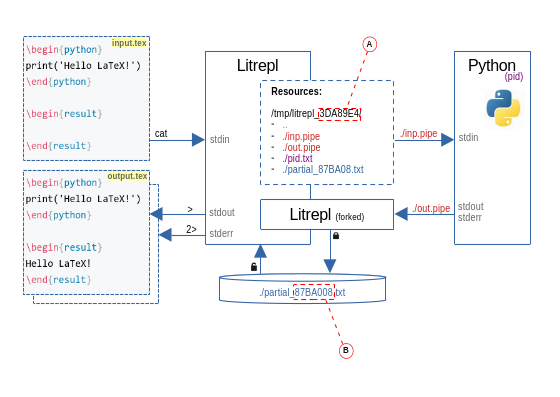

# Summary

Litrepl is a lightweight text processing tool designed to recognize and evaluate
code sections within Markdown or Latex documents. This functionality is useful
for both batch document section evaluation and interactive coding within a text
editor, provided a straightforward integration is established.  Inspired by
Project Jupyter, Litrepl aims to facilitate the creation of research documents.
Following developments in software deployment theory, however, we shift our
focus from informal reproducibility to enhancing transparency in communication
with interpreters by relying on POSIX interfaces: named pipes are accessible via
the file system, asyncronous process identifiers are visible in status reports.
The tool provides a comprehensive command-line interface, making it easier to
integrate with code editors. The project repository includes a reference Vim
plugin.

# Statement of need

Literate Programming, formulated by Donald Knuth, shifts the focus from merely
coding to explaining computational tasks to humans. This approach is seen in the
WEB system [@Knuth1984lp] and its successor tools, which use a document format
that interleaves code sections with explanatory text. These systems can produce
both readable documentation and executable code, and over time, this concept has
evolved towards simplification [@Ramsey1994lps].

The Read-Evaluate-Print Loop (REPL), a key concept in human-computer
interaction, gained importance in the LISP and APL communities [@Spence1975apl],
[@McCarthy1959recfun], [@Iverson1962apl]. By combining a command-line interface
with a language interpreter, REPL enables incremental and interactive
programming, allowing users to modify the interpreter state directly. This
approach is believed to enhance human thought processes by keeping users
actively involved [@Granger2021litcomp].

A pivotal development in this field was the IPython interpreter
[@Perez2007IPython], which led to the Jupyter Project and its Jupyter Notebook
format [@Kluyver2016jupnb]. This format consists of logical sections like text
and code that can interact with language interpreters, enabling REPL-like
programming for well-structured, shareable documents. This concept became a part
of *Literate Computing* [@Perez2015blog], which aims to reach broad audiences,
enhance reproducibility, and promote collaboration. Key technical aspects
include bidirectional communication between the Jupyter Kernel and Notebook
renderer, alongside client-server interactions between the web server and user
browser.

We believe that reproducibility is indeed crucial in the Literate Computing
framework, enhancing communication among dispersed researchers. However, as
illustrated by [@Dolstra2010], we argue that this challenge exceeds the capacity
of a single tool or library, needing a system-scale solutions. Such a solution
would define a reproducible environment in a formal language and would include a
closure of dependencies of every installed software component. The
responsibility of tools writers remains minimizing the added dependcies and
keeping the communication transparent to user [@Vallet2022].

In Table \ref{table} we list popular literate programming tools together with a
new **Litrepl** tool, developed by the author. We note that most existing tools
depend on Juptyer kerenls technology adding Web client-server and the
Xeus/ZeroMQ message passing library to the environment. Moreover, both Web and
ZeroMQ protocols define non-trivial states aiming to support multi-user modes
and various computer network conditions.

Litrepl, in contrast, focuses on a simple single-user communication held via
simple bi-directional text streams built into any modern operating systems. We
reduce the internal communication state down to a few entities all visible via
the file system by leveraging POSIX [@POSIX2024] system features. We hope that
this design will better align with formally-reproducible frameworks by modestly
reducing the number of supported use cases.

Litrepl builds on existing plain text markup formats with few or no extensions,
so the resulting documents remain simple text files. This makes the workflow
perfectly compatible with standard version control systems, enabling clean
diffs, code reviews, and collaboration. Such properties are especially
important for software developers, researchers, and technical writers who need
long-lived, reviewable documents.

\begin{footnotesize}
\begin{table}[!th]
    \caption{Litrepl compared to outher literate programming tools \label{table}.}
    \begin{tabular}{p{1.6cm}p{1.8cm}p{1.8cm}p{1.8cm}p{1.8cm}p{1.8cm}}
        \hline
        \hline
        Name & Document format & Data format & Interpreter & Backend & Frontend \\
        \hline
        Jupyter & Jupyter$^{j1}$ & Rich & Many$^{j2}$ & Client-server via ZeroMQ$^{j3}$ & Web, Editor \\
        \hline
        Quarto & Markdown$^{q1}$ & Rich & Few & Modified Jupyter$^{q2}$ & Web, Editor \\
        \hline
        Codebraid & Markdown$^{c1}$ & Rich & Many$^{c2}$ & Similar to Jupyter$^{c3}$ & Editor \\
        \hline
        R markdown & Markdown$^{r1}$ & Rich & Few$^{r2}$ & Linked libraries$^{r3}$ & Editor \\
        \hline
        Litrepl & Markdown, LaTeX & Text-only & Few & POSIX Pipes & Command line, Editor \\
        \hline
        \hline
    \end{tabular} \\
    $^{j1}$ \href{https://nbformat.readthedocs.io/en/latest/}{Jupyter Notebook Format} \\
    $^{j2}$ \href{https://github.com/jupyter/jupyter/wiki/Jupyter-kernels}{Available kernels} \\
    $^{j3}$ Details on Jupyter backend communication \href{https://docs.jupyter.org/en/latest/projects/kernels.html}{link} \\
    $^{q1}$ \href{https://quarto.org/docs/computations/execution-options.html}{Quarto Markdown extensions} \\
    $^{q2}$ Quarto uses the slightly modified Jupyter kernel protocol.
      See \href{https://quarto.org/docs/advanced/jupyter/kernel-execution.html}{Jupyter kernel support}
      and
      \href{https://github.com/quarto-dev/quarto_echo_kernel/blob/b77fde70c25a869175cc225a3676eee2df5a1733/README.rst}{Quarto echo kernel} \\
    $^{c1}$ Codebraid Markdown extensions are described as
      \href{https://codebraid.org/code_chunks/}{code chunks formatting} \\
    $^{c2}$ Codebraid supports Jupyter kernels
      \href{https://github.com/gpoore/codebraid/blob/3f85800bd58c2a1587778a1fe0f24c46dc1c3a69/README.md?plain=1#L13-L16}{link} \\
    $^{c3}$ Codebraid supports interactive editing via Jupyter kernels. \\
    $^{r1}$ \href{https://bookdown.org/yihui/rmarkdown/}{The R Markdown language} \\
    $^{r2}$ In RMarkdown most languages do not share a session between code sections,
      the exceptions are R, Python, and Julia
      \href{https://github.com/rstudio/rmarkdown-book/blob/521044173f39aee2c2f646f0712dfcdd6c22e214/02-basics.Rmd#L589}{link} \\
    $^{r3}$ For Python, RMarkdown relies on
      \href{https://github.com/rstudio/rmarkdown-book/blob/521044173f39aee2c2f646f0712dfcdd6c22e214/02-basics.Rmd#L603}{Reticulate}
      to run, which uses low-level Python features to organize the communication
      \href{https://github.com/rstudio/reticulate/blob/9f50ca05d3f0d478241944d925f8f931c8661817/src/event_loop.cpp#L15}{link}.
\end{table}
\end{footnotesize}

# How it works

The operation of Litrepl is best illustrated through the example below. Consider
the document named `input.tex`:

<!--
``` sh
echo '~~~ sh'
echo '$ cat input.tex'
echo '~~~'
echo '~~~ tex'
cat input.tex
echo '~~~'
```
-->
<!--result-->
~~~ sh
$ cat input.tex
~~~
~~~ tex
\begin{python}
import sys
print(f"I use {sys.platform.upper()} btw!")
\end{python}

\begin{result}
\end{result}
~~~
<!--noresult-->

This document contains a Python code section and an empty result section marked
with the corresponding LaTeX environment tags. To "execute" the code sections of
the document, we pipe the whole document through the Litrepl processor as
follows (only the last three relevant lines of the result are shown).

<!--
``` sh
echo '~~~ sh'
echo '$ cat input.tex | litrepl eval-sections | tail -n 3'
echo '~~~'
echo '~~~ tex'
echo "sys.platform='linux'" | litrepl repl python >/dev/null
cat input.tex | litrepl | tail -n 3
echo '~~~'
```
-->
<!--result-->
~~~ sh
$ cat input.tex | litrepl eval-sections | tail -n 3
~~~
~~~ tex
\begin{result}
I use LINUX btw!
\end{result}
~~~
<!--noresult-->

The side effect of this execution is the starting of a session with the Python
interpreter, which now runs in the background. Evaluation results are written
back into the result sections, and the entire document is printed. At this
stage, certain conditions can be optionally checked. First, adding
`--pending-exitcode=INT` instructs Litrepl to report an error if a section takes
longer than the timeout to evaluate. Second, setting `--exception-exitcode=INT`
directs Litrepl to detect Python exceptions. Lastly,
`--irreproducible-exitcode=INT` triggers an error if the evaluation result
doesn't match the text initially present in the result section.

## Interfacing Interpreters

Litrepl communicates with interpreters using POSIX uni-directional streams, one
for writing input and another for reading outputs. During the communication,
Litrepl makes the following general assumptions:

* The streams implement synchronous single-user mode.
* Command line prompts are disabled. Litrepl relies on the echo response, as
  described below, rather than on prompt detection.
* The presence of an echo command or equivalent. The interpreter must be able to
  echo an argument string provided by the user in response to such command.

The simplicity of this approach is a key advantage, but it also has drawbacks.
There's no parallel evaluation at the communication level, locking the
interpreter until each snippet is evaluated. This can be addressed by using
interpreter-specific parallelism, such as Python's subprocess utilities or shell
job control. The text-only data type limitation is more fundamental; Litrepl
overcomes this by supporting text-only document formats. Formats like LaTeX and
Markdown handle non-text data via references or side channels (e.g., file
systems), balancing benefits in version control with the need for explicit data
transfer organization.

## Session Management

Litrepl maintains interpreter sessions in the background to support REPL
experience. The components that builds up this functionality are illustrated on
the Figure \ref{figure}.



Resources are stored in an auxiliary directory specified by command-line
arguments, environment variables, or the current directory.  The session is
represented by a couple of pipes, the interpreter process identifier, and by a
sink file for asyncronous response. Litrepl connects to a session by sending the
contents of a code section to the input pipe and forking out a reader process
receiving the interpreter response from the output pipe. POSIX file lock
mechanism helps Litrepl to manage a possibly concurrent access to the pipes.

# Conclusion

The tool is implemented in Python in under 2K lines of code according to the LOC
metric, and has only two Python dependencies so far, at the cost of the
dependency on the POSIX operating system interfaces. Needless to say, we used
Litrepl to evaluate and verify the examples presented in this document.

# References

