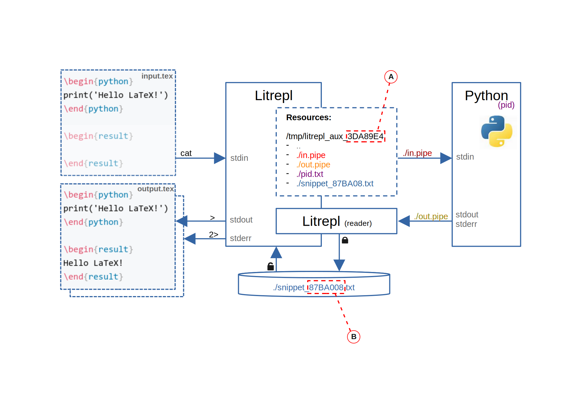

# Summary

TODO: The plan:

1. The concept of Literate programming was originally suggested by Donald Knuth
   - Mention WEB, CWEB
   - Mention two main modes: weave and tangle

2. Since then, the concept was largely simplified
   - NOWEB

3. And simplified even more, notable representative is
   - Literate Haskell

4. Independently, the concept of REPL appeared in the LISP developer community and get recognition
   through the IPython, interactive Haskell interpreter GHCi, RStudio IDE.

5. Eventually, the tools appear which combine both styles up to a some degree. Probably, the most
   well-known representative project is ''Jupyter Notebooks'', despite the fact that we can call it
   Literate programming tool with a little exageration.

6. We present ''Litrepl'' which unifies the two concepts into one paradigm of repeatedly running
   code sections while editing a "literate" document. As for Jupyter Notebook autohrs, our main goal
   is to make editing of research papers simpler.

7. The second goal is to promote reproducible research practices by supporting the verification mode
   which evaluates sections and warns if the new results differ from the expected ones.

7. Finally, we pursue a technical goal of having the tool modular, small and easliy-maintanable, for
   that we focus on re-using the existing formats and tools, such as text editors, document renderers,
   and operating system interfaces.

8. The tool is designed as a command-line text processor which is configured to recognize code
   blocks within the literate paper document, evaluate some or all of them by piping their contents
   through the programming language interpreter process running in the background, and, finally,
   paste the results of the evaluation into the pre-formatted result blocks.

9. The command-line interface is designed in a way, which allows simple integration into the text
   editors. The repository provides a Vim plugin illustrating how to do this.

10. The tool is implemented in Python in about 2K lines of code according to the LOC metric,
    supports LaTeX and Markdown document formats, containing code blocks written in Python (we
    support both Python and IPython interpreters), languages of the Bourn Shell family, and a custom
    AI model communication interpreter named Aicli.

11. The tool has only two Python dependencies so far, at the cost of an additional dependency on the
    operating system intefaces for which we choos POSIX as a wide-spread openly available standard.

# References

