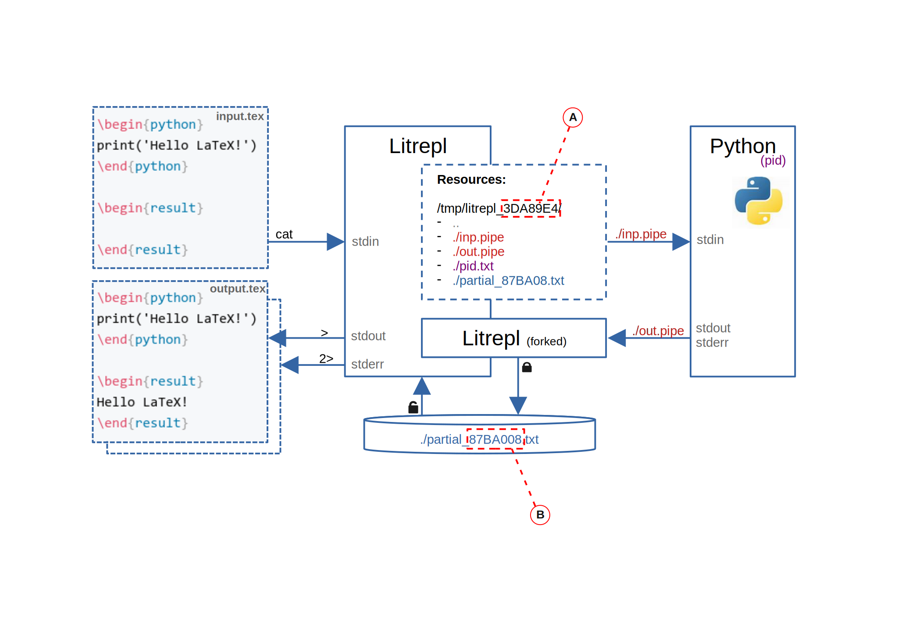

# Summary

Litrepl is a Python text processor for recognizing and evaluation code sections in Markdown or LaTeX
documents. Litrepl is designed as a middleware aimed at separating text editors from the programming
language interpreter management logic thus contributing to the diversity of both. In this role,
Litrepl can become a component of modular "UNIX Way" interactive development or typesetting
environments.

# Statement of need

TODO: The plan:

1. The concept of Literate Programming was originally suggested by Donald Knuth
   - Main idea: explaining to human beings what we want a computer to do
   - Mention WEB, CWEB, NOWEB
   - Mention the focus on non-interactive ahead-of-time compilation
   - Mention two main modes of operation: weave and tangle
   - Mention the trend towards the simplification(?)

2. By that time, another human-computer interaction concept, read-evaluate-print-loop or REPL,
   already gained some popularity via the LISP developer community as well as via then-designed APL
   language for mathematical calculations. The command line interface combined with the language
   interpreter allowed incremental and, most importantly, interactive programming by directly
   changing the interpreter state. Keep human in the loop, thus, helps human to think.

3. The next milestone was the IPython project evolved later as the Jupyter Project. The
   creators suggested the new document format called Notebook represented by a series of sections of
   various types not limited to text, some of which represented code and some the computation
   results.  Pairs of code and result sections of Notebooks can be used to communicate a programming
   language interpreter interactively allowing REPL style programming (keep human in the loop). The
   well-formed document allows readers to follow the narrative and is suitable for presentations and
   sharing.

   The authors formulated these ideas under the umbrella concept of Literate Computing, or building
   a computational narrative which is (1) spanning wide range of audience (2) bosting
   reproducibility and (3) collaboraiton.

   To fulfill these goals a number of technical decisions were made, the most important of these,
   along with the introduction of a document format, are: the inter-module communication between the
   computational core, known as Jupyter Kernel, and the Notebook plaing the role of a client,
   another client-server communication between Notebook web-server and the user web-browser.

5. While we agree on the importance of the main concept of Literate Computing, but we argue that the
   goal of reproducibility overshadows other mentioned goals. Being solved, it would both allow
   time-separated communication between parties of a research project and widen its audience. Yet,
   this problem, as shown by [Doostra et al] exceeds not only the scope of human-computer
   interaction system but even the scope of a typical programming language library distribution
   manager. An adequate solution to the softare deployment problem would necessarily be a
   whole-system solution such as Nix manager or a Docker container.

6. For this reason, we suggest focusing human-computer interaction at transparency rahter than
   reproducibility. Below we describe ''Litrepl'' tool which is simple yet powerful to bring the
   REPL interactive programming style into a common text editor.

8. First, we suggest re-using the existing text document formats and editors. In each of the two
   formats we implemented, Markdown and LaTeX, we use a simplified parsers to destinguish code and
   result sections from everything else. Second, we rely on the simple bi-directional text streams
   to communicate language interpreters via inter-process communication to evaluate code. At the
   time of this writing, we support families of Python and Shell interpreters and a custom AI
   communication interpreter. Finally, we leave as much as possible to the operating system
   facilities.

# How it works

7. Litrepl is designed as a command-line text processor in a way, making the integration into text
   editors as simple as passing the contents of the currently opened file through the utility. The
   repository provides an illustrative Vim plugin.

## Parsing

When the file appears on the Litrepl's stdin stream, it uses Earley parser to reliably recognize
   code and result sections.

## Evaluation

TODO

## Session management

10. The tool is implemented in Python in about 2K lines of code according to the LOC metric, and has
    only two Python dependencies so far, at the cost of the dependency on the operating system
    intefaces for which we choose POSIX as a wide-spread openly available standard.

# References

